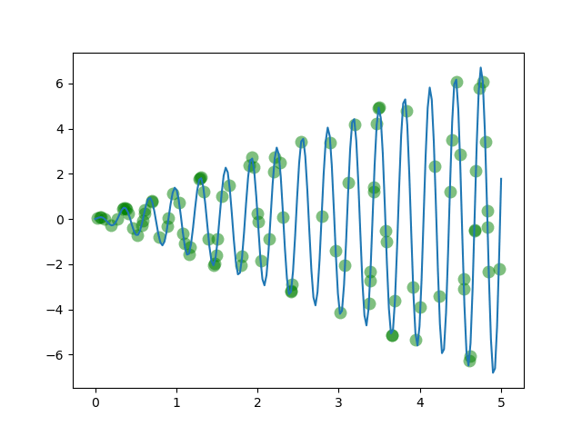

## Optimization using Evlutionary algorithms

### Results:

* Case 1: When the DNA size is limited to 1:

#### References:
* [MorvanZhou's awesome Evolutionary-Algorithm repo](https://github.com/MorvanZhou/Evolutionary-Algorithm)
* [Survey Report on Evolutionary Strategies](http://www.cmap.polytechnique.fr/~nikolaus.hansen/es-overview-2015.pdf)
