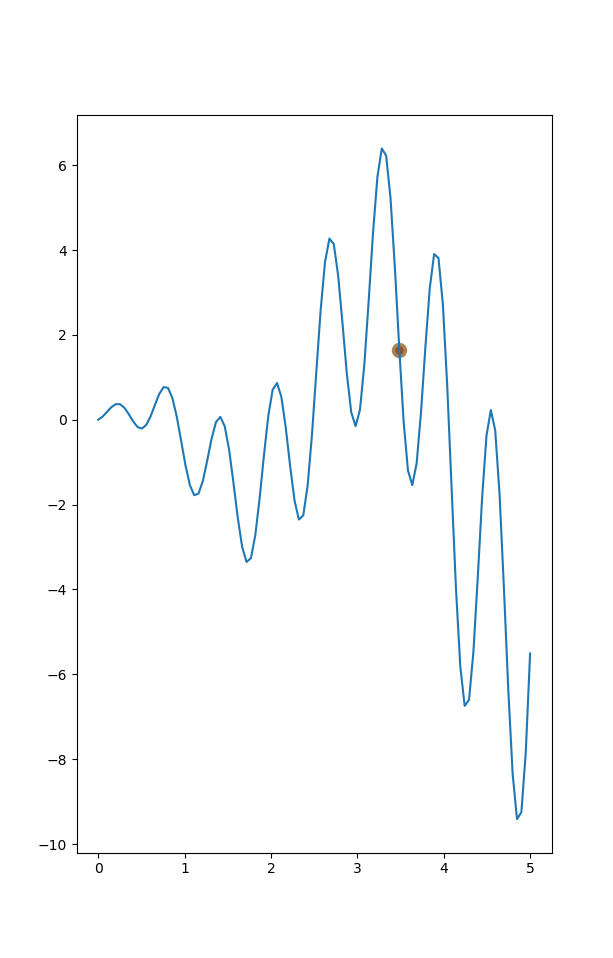

## Optimization using Evlutionary algorithms

### Results:

* Finding maxima using crossovers and mutations:

* Finding maxima using (1+1)-ES and Rechenberg's 1/5th rule:

#### References:
* [MorvanZhou's awesome Evolutionary-Algorithm repo](https://github.com/MorvanZhou/Evolutionary-Algorithm)
* [Survey Report on Evolutionary Strategies](http://www.cmap.polytechnique.fr/~nikolaus.hansen/es-overview-2015.pdf)
